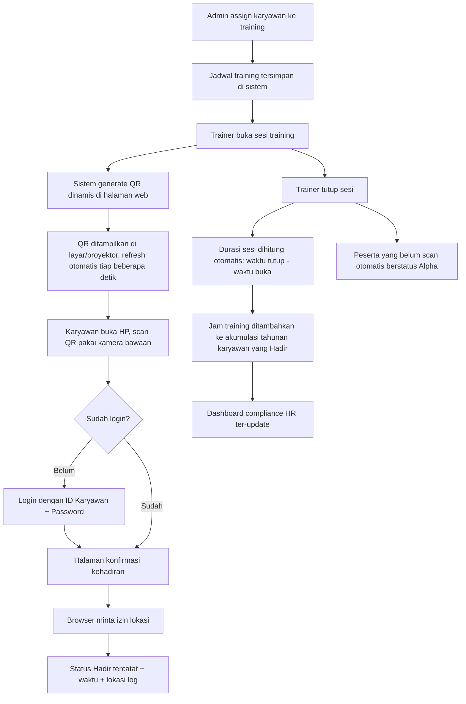
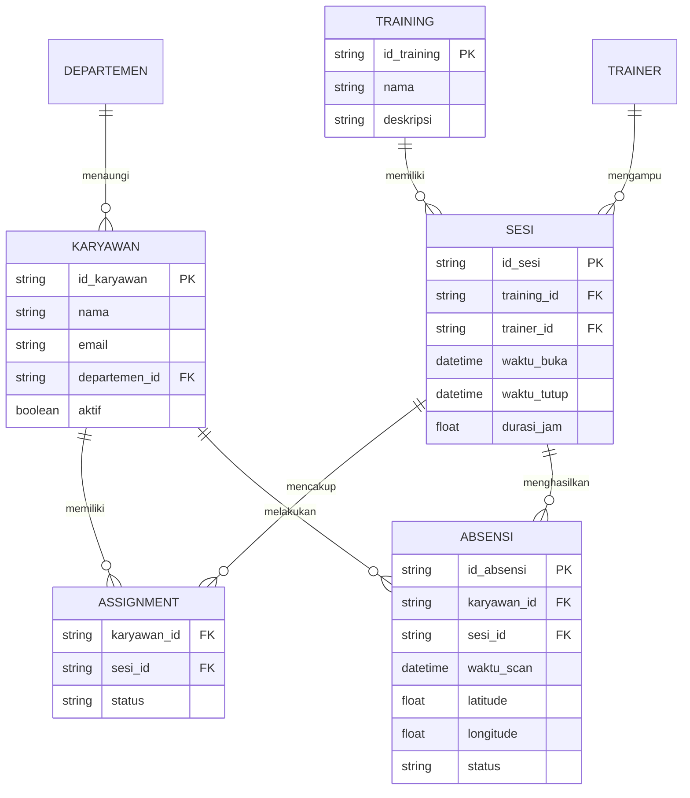

# Product Requirements Document (PRD)
# Sistem Absensi Training Karyawan Berbasis QR Code

| | |
|---|---|
| **Versi** | 1.0 |
| **Tanggal** | 18 September 2026 |
| **Status** | Draft |
| **Pemilik Dokumen** | Tim Product / L&D |

---

## 1. Latar Belakang

Perusahaan menyelenggarakan program training internal untuk karyawan, dengan kewajiban setiap karyawan mengikuti **minimal 6 jam training per tahun** sebagai bagian dari compliance pengembangan SDM. Saat ini proses absensi training kemungkinan masih manual (tanda tangan kertas / Excel), yang menyulitkan tim HR/L&D untuk:

- Memantau kehadiran secara real-time
- Menghitung akumulasi jam training tiap karyawan secara akurat
- Mengetahui siapa saja yang belum memenuhi target di akhir tahun
- Menghasilkan laporan compliance dengan cepat

Sistem ini dibangun untuk mendigitalkan proses absensi training menggunakan **QR code dinamis**, sehingga proses lebih cepat, minim kecurangan, dan datanya langsung terhubung ke sistem pelaporan compliance.

## 2. Tujuan

1. Mendigitalkan proses absensi training dari manual menjadi scan QR code.
2. Menghitung otomatis akumulasi jam training tiap karyawan per tahun.
3. Memberi visibilitas ke tim HR/L&D terkait siapa yang sudah/belum memenuhi target 6 jam/tahun.
4. Mengurangi risiko kecurangan absensi (titip absen) melalui QR dinamis.
5. Menyediakan laporan yang bisa diekspor untuk kebutuhan audit/compliance.

## 3. Ruang Lingkup

### 3.1 Termasuk dalam Scope (MVP)
- Manajemen data master: karyawan, departemen, trainer, program training, jadwal
- Assignment karyawan ke training oleh Admin/HR
- Pembuatan sesi training & QR code dinamis oleh Trainer
- Proses scan absensi oleh karyawan via browser HP (tanpa install aplikasi)
- Pencatatan lokasi saat scan (sebagai log, bukan validasi)
- Perhitungan otomatis durasi & akumulasi jam training tahunan
- Dashboard compliance untuk HR
- Export laporan (Excel/PDF)
- Autentikasi berbasis akun (ID karyawan + password)

### 3.2 Di Luar Scope (Out of Scope untuk MVP)
- Integrasi dengan sistem HRIS/payroll perusahaan
- Aplikasi mobile native (iOS/Android)
- Validasi/geofencing lokasi yang menolak absensi
- Status kehadiran selain Hadir/Alpha (Izin, Sakit, Terlambat) — dicatat sebagai catatan untuk pengembangan lanjutan
- Pembatasan satu akun hanya bisa login di satu device
- Sertifikasi/e-certificate otomatis pasca training
- Multi-cabang/multi-lokasi kantor

## 4. Definisi & Istilah

| Istilah | Definisi |
|---|---|
| Training | Program pelatihan yang diikuti karyawan |
| Sesi | Satu kali pelaksanaan training pada tanggal & jam tertentu |
| Trainer | Pemateri/fasilitator yang membuka sesi training |
| Peserta | Karyawan yang ditugaskan mengikuti training |
| QR Dinamis | QR code yang otomatis regenerate/refresh secara berkala selama sesi berlangsung |
| Compliance Target | Target minimal 6 jam training per karyawan per tahun kalender |

## 5. Aktor & Peran

### 5.1 Admin / HR (L&D Team)
Mengelola seluruh data master dan memantau compliance.
- CRUD data karyawan, departemen, trainer
- CRUD program training & jadwal
- Assign karyawan ke sesi training (wajib ikut)
- Melihat dashboard compliance (progress jam training tiap karyawan)
- Export laporan kehadiran & compliance (Excel/PDF)
- Melihat log lokasi absensi per sesi

### 5.2 Trainer
Memfasilitasi training dan mengelola sesi absensi.
- Melihat jadwal training yang diampu
- Membuka sesi training → sistem generate QR dinamis, ditampilkan di layar/proyektor
- Menutup sesi training (durasi otomatis terhitung dari buka–tutup)
- Melihat daftar peserta yang sudah/belum absen secara real-time
- Melihat rekap kehadiran untuk sesi yang diampu

### 5.3 Karyawan (Peserta)
Mengikuti training dan melakukan absensi.
- Login menggunakan ID karyawan + password
- Melihat daftar training yang di-assign ke dirinya
- Scan QR code menggunakan kamera HP untuk absen
- Melihat riwayat kehadiran & total akumulasi jam training tahun berjalan
- Melihat progress terhadap target 6 jam/tahun

## 6. Alur Utama (Core Flow)

**Poin penting terkait anti-kecurangan:** karena QR bersifat dinamis (refresh berkala), QR yang di-screenshot/difoto akan kedaluwarsa dalam hitungan detik, sehingga tidak bisa dipakai untuk absen dari jarak jauh oleh orang lain.

## 7. Functional Requirements

### 7.1 Modul Manajemen Data Master (Admin)
| ID | User Story | Kriteria Penerimaan |
|---|---|---|
| FR-01 | Sebagai Admin, saya ingin mengelola data karyawan (tambah/edit/nonaktifkan) | Data tersimpan dengan field minimal: ID karyawan, nama, email, departemen, status aktif |
| FR-02 | Sebagai Admin, saya ingin mengelola data trainer | Trainer bisa di-assign ke satu atau lebih program training |
| FR-03 | Sebagai Admin, saya ingin membuat program training baru | Field: nama training, deskripsi, kategori |
| FR-04 | Sebagai Admin, saya ingin membuat jadwal sesi training | Field: training terkait, trainer, tanggal, jam mulai rencana |
| FR-05 | Sebagai Admin, saya ingin meng-assign karyawan ke sesi training tertentu (wajib ikut) | Karyawan yang di-assign otomatis muncul di daftar training miliknya |

### 7.2 Modul Sesi & Absensi (Trainer)
| ID | User Story | Kriteria Penerimaan |
|---|---|---|
| FR-06 | Sebagai Trainer, saya ingin membuka sesi training untuk memulai absensi | Sistem generate QR code unik untuk sesi tersebut, waktu mulai tercatat |
| FR-07 | Sebagai Trainer, saya ingin QR code otomatis refresh secara berkala | QR berganti/regenerate tiap interval waktu tertentu (default: 15 detik, dapat dikonfigurasi) selama sesi masih dibuka |
| FR-08 | Sebagai Trainer, saya ingin melihat daftar peserta yang sudah scan secara real-time | List peserta ter-update otomatis tanpa perlu refresh manual halaman |
| FR-09 | Sebagai Trainer, saya ingin menutup sesi training | Waktu tutup tercatat; peserta yang belum scan otomatis berstatus Alpha; durasi sesi (jam training) dihitung otomatis dari selisih waktu buka–tutup |

### 7.3 Modul Absensi (Karyawan)
| ID | User Story | Kriteria Penerimaan |
|---|---|---|
| FR-10 | Sebagai Karyawan, saya ingin login menggunakan ID karyawan & password | Autentikasi berbasis session/JWT |
| FR-11 | Sebagai Karyawan, saya ingin scan QR menggunakan kamera bawaan HP tanpa install aplikasi | QR berisi link yang langsung membuka halaman web absensi di browser |
| FR-12 | Sebagai Karyawan, saya ingin sistem mencatat lokasi saya saat scan | Lokasi (lat/long) diminta via browser geolocation API dan disimpan sebagai data log, tidak memblokir proses absen jika ditolak/tidak tersedia |
| FR-13 | Sebagai Karyawan, saya ingin melihat riwayat training & total jam saya tahun ini | Halaman menampilkan daftar training yang diikuti dan progress bar terhadap target 6 jam |

### 7.4 Modul Compliance & Dashboard (Admin/HR)
| ID | User Story | Kriteria Penerimaan |
|---|---|---|
| FR-14 | Sebagai HR, saya ingin melihat dashboard akumulasi jam training tiap karyawan | Menampilkan total jam per karyawan per tahun berjalan, dengan indikator status (sudah/belum capai target) |
| FR-15 | Sebagai HR, saya ingin memfilter karyawan yang belum mencapai target 6 jam | Filter berdasarkan status compliance, departemen, rentang tanggal |
| FR-16 | Sebagai HR, saya ingin mengekspor data kehadiran & compliance | Export ke format Excel dan PDF, mencakup detail per sesi maupun rekap tahunan |
| FR-17 | Sebagai HR, saya ingin melihat log lokasi absensi per sesi | Menampilkan lokasi scan tiap peserta untuk keperluan monitoring |

## 8. Non-Functional Requirements

| Kategori | Kebutuhan |
|---|---|
| **Keamanan** | Password di-hash (bcrypt/argon2); komunikasi via HTTPS; QR token unik & tidak bisa ditebak (random, bukan sequential) |
| **Performa** | Halaman absensi harus dapat merespons dalam <2 detik saat diakses bersamaan oleh puluhan peserta dalam satu sesi |
| **Skalabilitas** | Mendukung puluhan hingga ratusan karyawan aktif dan multiple sesi training paralel |
| **Ketersediaan** | Target uptime 99% pada jam kerja |
| **Kompatibilitas** | Halaman absensi responsif dan berfungsi baik di browser mobile umum (Chrome, Safari) tanpa instalasi aplikasi |
| **Audit Trail** | Setiap aksi buka/tutup sesi, assignment, dan perubahan data master tercatat log-nya |

## 9. Model Data (Ringkasan Entitas)

## 10. Rekomendasi Tech Stack

| Layer | Rekomendasi | Alasan |
|---|---|---|
| Frontend | Next.js (React) | SSR untuk performa awal cepat, responsif untuk web di HP dan desktop |
| Backend | Node.js (NestJS) | Struktur modular, cocok untuk API + WebSocket (refresh QR real-time) |
| Database | PostgreSQL | Relasional, cocok untuk data karyawan/training/absensi yang terstruktur dan butuh query agregasi (jam training) |
| Realtime QR refresh | WebSocket / Server-Sent Events | Update QR di layar tanpa reload halaman |
| Autentikasi | JWT + refresh token | Stateless, mudah di-scale |
| Export laporan | Library seperti `exceljs` (Excel) & `pdf-lib`/`puppeteer` (PDF) | Umum digunakan, terbukti stabil |
| Hosting | Cloud VM/Container (mis. AWS/GCP) atau on-premise sesuai kebijakan IT perusahaan | Menyesuaikan skala puluhan-ratusan pengguna |

*Catatan: rekomendasi ini dapat disesuaikan bila tim IT perusahaan sudah punya standar teknologi tersendiri.*

## 11. Asumsi & Batasan

- Karyawan memiliki akun yang sudah terdaftar di sistem (dibuat oleh Admin), belum ada self-registration.
- Perusahaan beroperasi di satu lokasi kantor untuk fase MVP ini.
- Lokasi hanya dicatat sebagai data log/monitoring, tidak digunakan untuk menolak absensi.
- Status kehadiran dibatasi pada "Hadir" dan "Alpha" untuk MVP.
- Tidak ada batas waktu window absen — selama sesi masih dibuka trainer, karyawan tetap bisa melakukan absensi.
- Target compliance (6 jam/tahun) dihitung berdasarkan tahun kalender berjalan.

## 12. Metrik Keberhasilan

- 100% sesi training tercatat digital (tidak ada lagi absensi manual kertas).
- Waktu proses absensi per karyawan < 15 detik (dari scan hingga status "Hadir" tersimpan).
- Tim HR dapat menghasilkan laporan compliance tahunan dalam < 5 menit (vs proses manual sebelumnya).
- Penurunan signifikan kasus titip absen (dipantau melalui log lokasi & anomali pola scan).

## 13. Risiko & Pertimbangan Lanjutan

| Risiko | Mitigasi/Catatan |
|---|---|
| Karyawan tanpa smartphone/kamera berfungsi | Sediakan opsi input manual oleh trainer sebagai fallback |
| Koneksi internet buruk saat scan | QR link tetap dapat diakses selama jaringan kantor stabil; pertimbangkan pesan retry yang jelas |
| Karyawan menolak izin lokasi di browser | Absensi tetap diproses, hanya data lokasi kosong (sesuai kesepakatan bahwa lokasi bukan syarat wajib) |
| Kebutuhan status Izin/Sakit di masa depan | Sudah diidentifikasi sebagai item pengembangan lanjutan, belum masuk MVP |

## 14. Pertanyaan Terbuka (Open Questions)

- Apakah perlu notifikasi (email/lainnya) untuk mengingatkan karyawan yang belum memenuhi target menjelang akhir tahun? jawaban : iya, perlu
- Apakah interval refresh QR 15 detik sudah sesuai, atau perlu disesuaikan berdasarkan uji coba lapangan?, jawaban : sudah 
- Apakah laporan compliance perlu di-breakdown per departemen untuk kebutuhan manajemen? jawaban : perlu

---

*Dokumen ini adalah draft awal dan dapat direvisi seiring diskusi lebih lanjut dengan stakeholder.*
